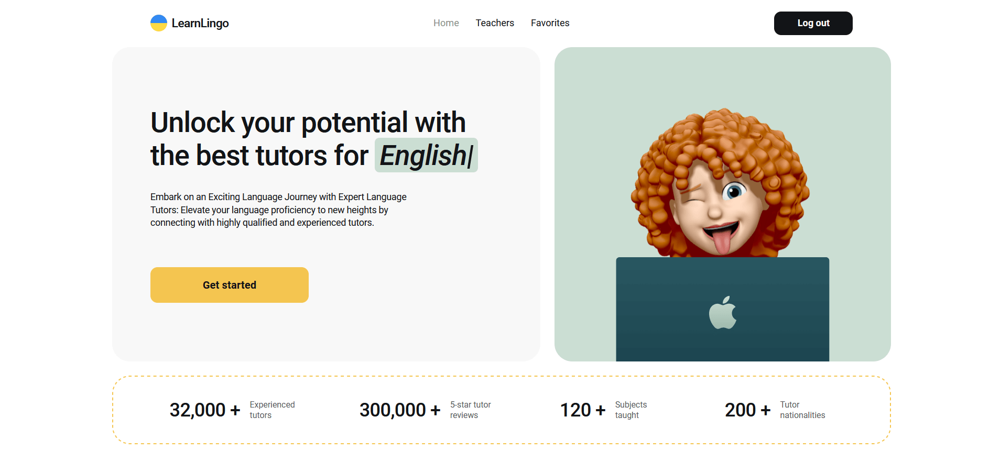
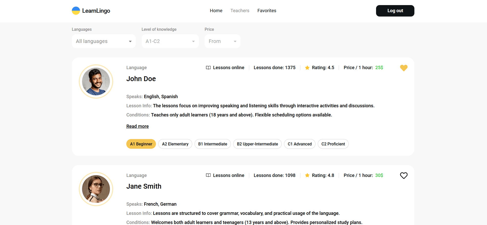
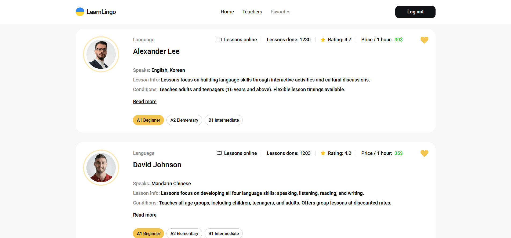

# Learn Lingo

## Project Description

This project is a web application for a company offering online language tutoring services, built using Next.js, Typescript, Firebase_DB. It consists of the following pages:

1. **Home Page**: Displays the advantages of the company and contains a link to start using the application, redirecting to the "Teachers" page.

2. **Teachers Page**: Lists the available tutors, which users can filter by language, student proficiency level, and hourly rate.

3. **Favorites Page**: A private page where users can view a list of tutors they have added to their favorites.

### Technical Requirements

1. **Authentication**: Users can register, login, retrieve user data, and logout using Firebase Authentication.

2. **Registration/Login Form**: Implemented using Formik and Yup. All fields are required, and the modal window with the form can be closed in various ways.

3. **Tutors Database**: Utilizes Firebase Realtime Database to store tutor data.

4. **Tutor Card**: Designed according to the layout with a description of the tutor's characteristics.

5. **Pagination on Teachers Page**: Displays 4 cards per page, and additional cards can be loaded by clicking pagination buttons.

6. **Adding to Favorites**: Clicking the "heart" button adds a tutor to the favorites list (Firebase collection "favorites") for authenticated users.

7. **Persisting User Actions**: After page refresh, user actions remain intact, such as the status of the "heart" button on a tutor card.

8. **Removing from Favorites**: Clicking the "heart" button again removes the tutor from the favorites list.

9. **Detailed Tutor Information**: Clicking the "Read more" button reveals additional information about the tutor and reviews from students.

10. **Booking Trial Lesson**: Clicking the "Book trial lesson" button opens a modal window with a form for booking a trial lesson, also implemented using Formik and Yup.

### Styling and Deployment

- Responsive design for mobile, tablet, and desktop devices.
- Project deployed on Vercel.
- Styles written using .scss modules.

### Running the Project Locally

1. Clone the repository.
2. Install dependencies: `npm install`.
3. Run the project: `npm run dev`.

### Author

Author: Yuliia Koliesnik